# Redis

## 基本数据结构：

- SDS 简单动态字符串 （在Redis中包含字符串值的key value在底层都是由SDS实现）

  SDS:

  ```
  struct sdshdr {
  	//已使用字节数
      int len;
      //未使用字节书
      int free;
      //保存字符串 最后一个字节用于保存空字符 '\0' 遵循此规则为了重用C字符串库的函数
      char buf[];
  }
  ```

  SDS对于C字符串

  - 额外利用len字段保存字符串长度，避免获取长度时还需要遍历，使获取字符串时间复杂度 --> O(1)
  - 在字符串扩展前可以先检查字符串长度，对字节数组先进行扩展
  - SDS采用空间预分配策略，空间扩展时会额外分配 SDS长度的未使用空间 在SDS大小<1MB时，否则则增加1MB未使用空间
  - 懒惰空间释放，字符串缩短时不回收多出来的空间，而是记录到free等待将来使用

- List

  双向，无环，带表头尾指针，带长度计数器，链表节点用void* 保存节点值，可保存不同类型值

  当一个列表键包含的键值对比较多，或者键值对中元素都是较长的字符串时，Redis会采用链表作为链表键的底层实现

  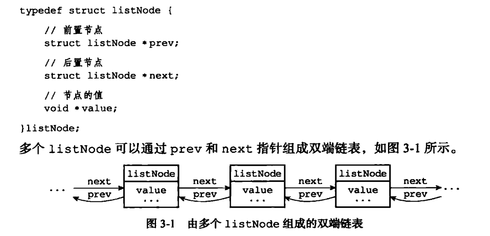

- 字典

  链式将多个哈希值相同的健值对连接，解决冲突

  当一个哈希键包含的键值对比较多，或者键值对中元素都是较长的字符串时，Redis会采用字典作为哈希键的底层实现

  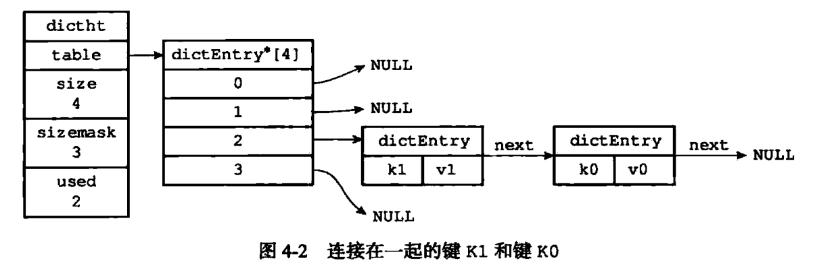

- 跳跃表

  有序数据结构，通过在每个节点维持多个指向其他节点的指针，从而达到快速访问的目的

  支持平均 O(logN) 最坏 O(N) 

  

  每一个结点不单单只包含指向下一个结点的指针，可能包含很多个指向后续结点的指针，这样就可以跳过一些不必要的结点，从而加快查找、删除等操作。对于一个链表内每一个结点包含多少个指向后续元素的指针，这个过程是通过一个随机函数生成器得到，这样子就构成了一个跳跃表。

- 整数集合

  当集合只包含整数值元素，并且集合元素个数不多时用整数集合实现集合健

  底层为数组，有序，无重复的保存集合元素

  当新加入的元素比现有所有元素的类型要长时，需要先升级

- 压缩列表

  list,hash底层实现之一，当列表包含少量项，并且项为小整数值，或者短字符串，Redis则通过压缩列表实现列表键

  哈希键也是在类似条件下采用压缩列表作为底层实现

  压缩列表的目的主要用于节约内存

  由一系列特殊编码连续内存块组成的顺序型数据结构

  一个压缩列表可包含多个实体，一个实体可保存一个字节数组或者整数值

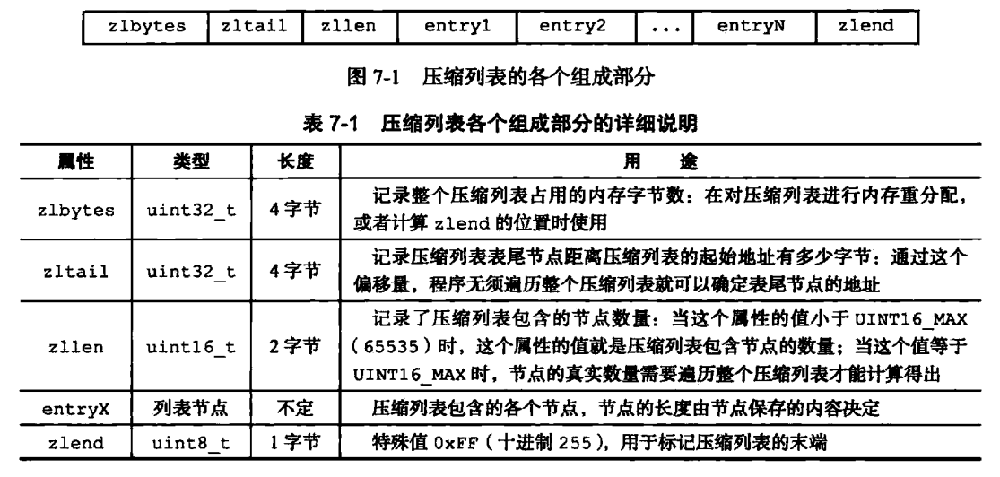

​	示例：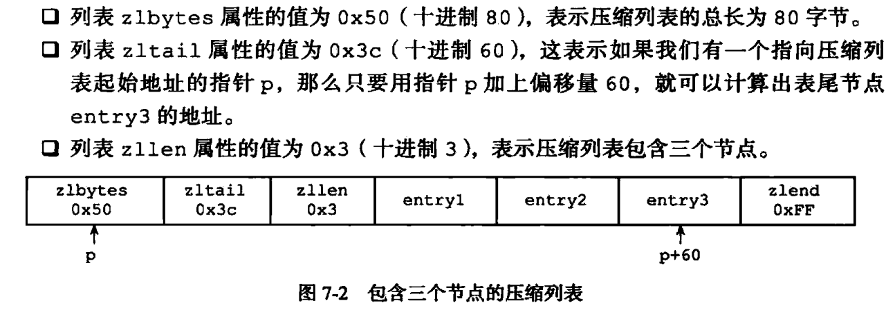

## 对象模型

Redis 基于其基本数据结构，创建了一个对象系统，包含了：

- 字符串
- 列表
- 哈希
- 集合
- 有序集合

Redis在执行命令前，会通过对象类型判断对象是否可以执行命令

还可以通过不同的场景，采用不同的底层数据结构实现

Redis还实现了基于引用计数的内存回收

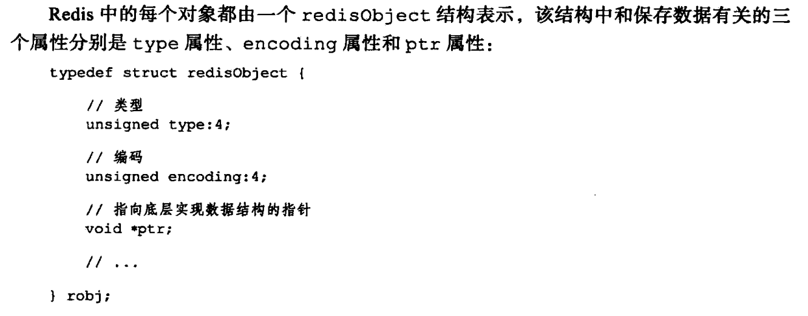


TYPE :: 对象的类型

ENCODING :: 对象使用的底层数据结构

采用 `OBJECT ENCODING ` 可以查看一个对象的底层数据结构类型


### string

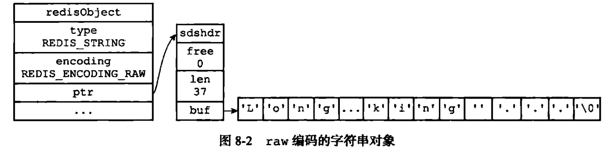

短字符串优化编码

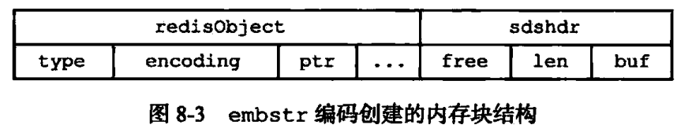

好处：

- 降低创建字符串对象的内存分配次数 2-->1 （释放同样）
- embstr编码的字符串对象数据连续，可以更好的利用缓存


### list

`redis> RPUSH numbers 1 "three" 5`

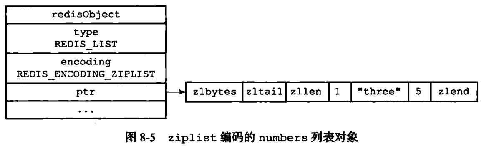


以下"three"是一个字符串对象SDS的嵌套

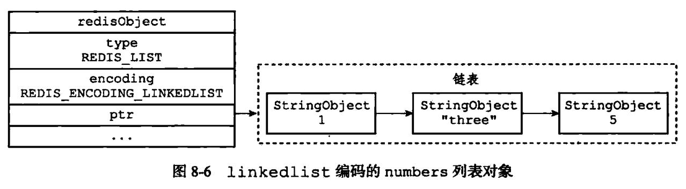


### 哈希对象


ziplist编码

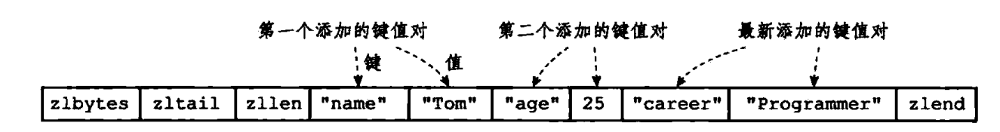


hashtable编码

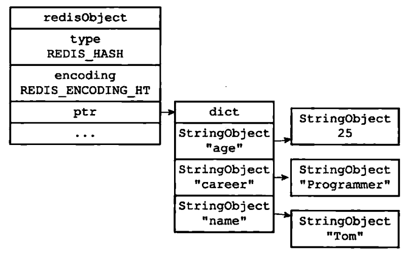

### 集合


使用哈希表实现集合时，哈希表的值全部为null

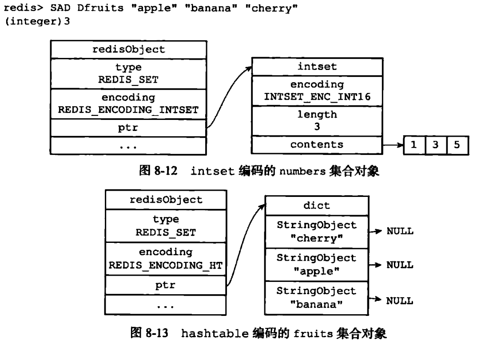


### 有序集合对象

ziplist 实现


跳跃表+字典实现，其中相同元素成员都是通过指针共享，所以没有重复的元素，值

好处：

- 利用字典，可以使得查找某一成员分值这一操作的时间复杂度为O(1)
- 利用跳跃表，可以使得执行一些范围操作不像字典还需要再进行排序，而且也有跳跃表进行范围操作的优点

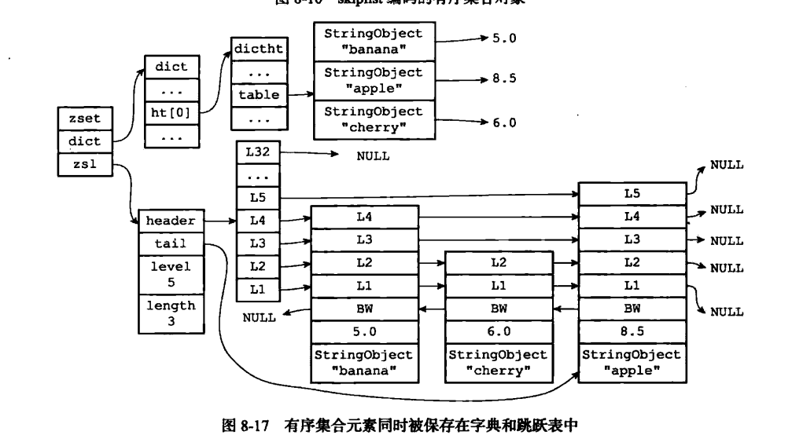


## 事务

## 原子操作

