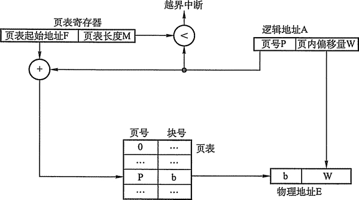
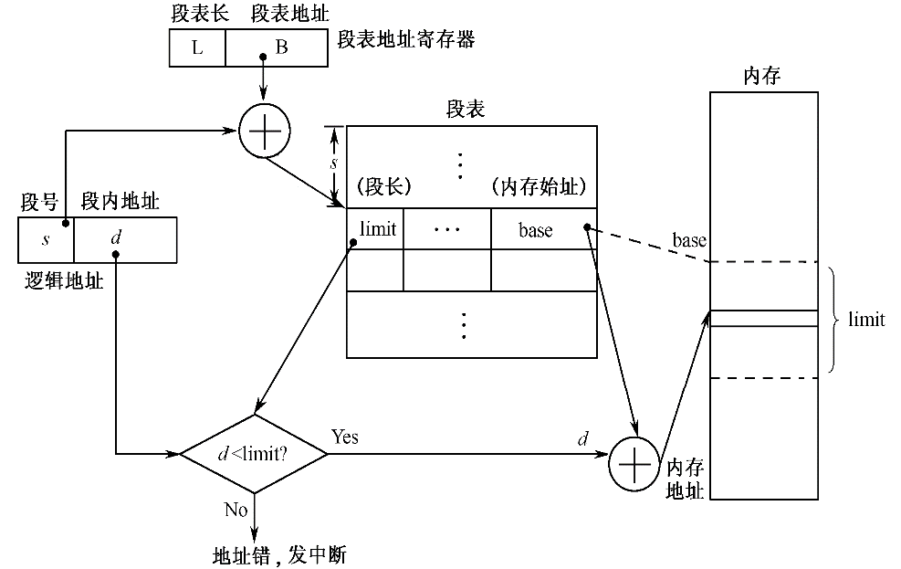
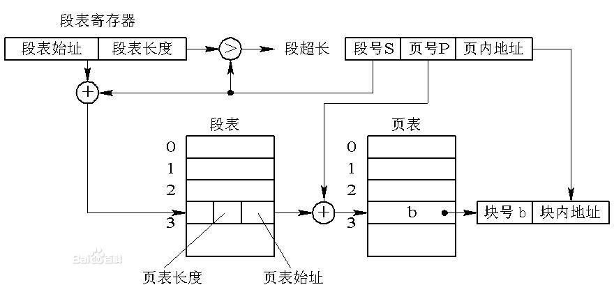

## 基于Linux学习内存管理

## 前言

## 重点题目

分段，分页 逻辑地址转物理地址

页面置换

分区

## 联系编程

Go语言垃圾回收

## 大纲

- 地址空间 （存储器抽象）
- 重定位
- 分区
- **分页，分段**
- **段页式系统**
- 虚拟内存
  - 请求分页
  - 缺页中断
- 内存抖动
- Linux下的内存管理

## 细讲

### 地址空间

直接暴露物理内存给进程，主要有两个问题

1. 进程可以寻址内存的每个字节，有可能会破坏操作系统的正常运行
2. 多个进程同时运行时，进程操作同一片物理内存时可能会出现问题

地址空间是一种对物理内存的一种抽象，使得多个进程同时存在在内存中并且不互相影响，地址空间是对进程抽象的内存，每个进程都有自己的地址空间，并且不同进程的地址空间相互独立

地址空间仅仅是对进程做了一层物理内存的抽象，使得进程使用内存不用考虑复杂的问题，进程实质上使用的还是物理内存

所以引入重定位技术，以实现地址空间到物理空间的映射

### 重定位

根据映射的时机，重定位可分为：

- 静态重定位

**目标程序装入内存时** ，由装入程序改写程序中指令和数据的地址，在程序运行期间不再进行重定位

（程序静态链接）

优点：不需要额外的硬件地址转换机构

缺点：

1. 程序的存储空间只能是连续的一片
2. 重定向后空间不可移动

- 动态重定位

**程序执行期间**，每次访问内存前都进行重定位，依赖地址转换机构

优点：

1. 程序占用的内存空间动态可变
2. 目标程序装入内存时无需任何修改

### 分区法

除操作系统占用内存低址外，其余内存分配给用户进程，划分若干分区，每个分区容纳一个分区，按分区划分方法，有：

- 固定分区法

使用一个分区说明表记录每个划分的分区的大小，基址，使用情况

- 动态分区法

各个分区时在相应进程进入内存时才建立的，使其大小适应进程大小

**常用的数据结构：**

1. 空闲分区表 -- 表项：分区号，分区大小，起始地址，分区状态
2. 空闲分区链 将所有空闲分区链接成一条链

**分配算法：**

- 最先适应算法 First Fit

空闲表按位置排序，地址越小序号越小

优点：为大进程预留高地址的空闲空间

缺点：高地址，低地址利用不均匀

- 最佳适应算法 Best Fit

空闲表按空闲块大小升序排序

在满足进程要求前提下，尽量分配最小的空闲块

- 循环适应算法 Next Fit

每次找到合适的空闲块时，记下位置，下次查找空闲块直接从这里往下查找

- 最坏适应算法 Worst Fit

最佳分配算法的反向

分区的

优点：需要的硬件支持很少，易实现

缺点：碎片严重，内存利用率低，作业大小受内存限制

### 分页法

**逻辑地址分页：** 将一个进程的逻辑地址空间划分成若干大小相等的部分，每个部分成为页

**内存空间分块：** 将内存划分成与页面大小相同的若干存储块，称作内存块

**逻辑地址地址表示：**

| **31**    **12** | **11**    **0** |
| -------------------------------------------------- | ------------------------------------ |
| **页号p**                                          | **页内地址d**                        |

此处逻辑地址为32位

12~31位为页号表示地址空间中最多纳 2^20 个页面

11~0位为页内地址表示页的大小为 2^12B = 4KB

**页表**

因为分页系统中,进程的个页面离散分布在内存的任何空闲块中,则出现页号连续,块号不连续的情况,为找到对应页号的物理块,所以设立的页表

| 页号 | 块号 |
| ---- | ---- |
| 0    | 3    |
| 1    | 5    |
| 2    | 6    |

进程地址空间(已知页号)->查页表->获得对应块号->查内存

**简述分页存储管理的地址变换过程**

通常,页表放在内存中,当进程需要访问某个逻辑地址中的数据时,

1. 分页地址映象硬件自动按页面大小将CPU得到的有效地址(逻辑地址)	分成两部分,页号,页内地址(p,d)
2. 以页号p为索引去检索页表,得到该页物理块号,把它装入物理地址寄存器中,
3. 同时,将页内地址d直接送入物理地址寄存器的块内地址字段,

这样,物理地址寄存器中的内容就是由两者拼接而成的实际访问内存的地址,从而完成逻辑地址到物理地址的转换

### 分段法

进程的地址空间分成多个段,

逻辑地址分为段号,段内地址

每一段映射到内存的某一片内存

| 段号 s | 段内地址 d |
| ------ | ---------- |
|        |            |

地址结构

1. CPU将逻辑地址分为	段号s 段内地址d
	. 系统将该进程段表地址寄存器中的内容B(段表地址)	与段号s相加	得到寻找的段表项索引值,从该项得到段长limit段在内存的基址base		
3. 将段内地址d与段长limit比较若d>=limit 发越界中断,否则 则地址合法将段内地址d与内存基址相加,得到要访问单元的内存地址

**分段，分页区别**

1. 页是信息的物理单位

   段是信息的逻辑单位

2. 页的大小由系统确定

   段的长度因段而异

	. 分页的进程地址空间是一维的	(页号)

   分段地进程地址空间是二维的 (段名,段内地址)

4. 分页系统很难实现过程与数据的分离

### 段页式结合系统

**基本原理**

- 等分内存	把整个内存分成大小相等的内存块
- 进程的地址空间采用分段
- 段内分页
- 逻辑地址结构

逻辑地址: 段号s 段内页号 p页内地址 d 

| 段号s | 段内页号p | 页内地址d |
| ----- | --------- | --------- |
|       |           |           |

- 内存分配
内存分配单位为内存块
-   段表 
	每个进程建立一个段表,每段建立一个页表		

进程段表

| 页表长度 | 页表地址 |
| -------- | -------- |
|          |          |

每一项表示每一段的起始页表地址与页表长度

用户程序逻辑上划分为若干段每段分成若干页面 内存划分成对应大小的块

进程映像替换以页为单位进行,使得逻辑上连续的短存放在分散的内存块中

系统中存在一个段表地址寄存器指出进程的段表长度,段表起始地址

1. 地址转换硬件将段表地址的寄存器B	与 逻辑地址中段号	相加(偏移量)	得到要访问进程段表的	第s段的 入口地址	(段表项)
2. 将段s表项的页表长度与逻辑地址的p	做比较若页号小于页表长度表示未越界, 否则发中断
3. 将段s表项的页表基址与页号p相加	(偏移)	得到访问段s	第p页的	入口地址(段s的页表的第p页页表项)
4. 从段s的页表的第p页页表项	中读出该页所在 物理块号f 再用物理块号f 与逻辑地址中的 页内地址d 拼接成物理地址
5. 若对应页不在内存中,发缺页中断,系统进行缺页处理，若该段页表未在内存中建立, 则发缺段中断,然后由系统在内存中为该段建立页表

### 虚拟内存

每个进程拥有独立的虚拟地址，在Linux 中被分割成多个页，映射到物理内存中，但并不是所有页都在内存时才能运行程序，如果程序引用到一段内存地址空间时，虚拟地址是先送到MMU（内存管理单元）进行映射，

如发现请求的数据

- 不再物理内存中，则产生**缺页中断**，cpu陷入内核态，执行**页面置换算法**，修改映射并重新执行失败的指令
- 如果直接在内存中，就直接去访问物理内存

对于Linux来说，被交换出去的页面就会在磁盘中，用户交换的磁盘空间必须是一个独立的分区，这个分区就是swap分区，页在swap分区以及内存间的切换称为 swap in  / swap out 

由于硬盘与内存的I/O速度不再同一个数量级，使用磁盘作为swap分区必然导致性能降低，但是这减少了内存空间日常占用的大小，是一种**时间换空间**的方案

如果不设置swap分区，即不使用虚拟内存，在内存满了之后，系统就会杀死一些进程来释放内存完成其他工作

> 题外话：所以在Linux下分区时，swap分区尽量不要设置在ssd，因为swap分区中频繁的换入换出会快速降低ssd的寿命（因为频繁擦写）

**页面置换算法**

belady 现象 -- 缺页率随内存块增加而增加

- FIFO 先进先出

  总是淘汰在内存停留时间最长的一页

  存在belady现象

  ​

- OPT 最佳置换算法

  选择淘汰最远的将来才被访问的页

  缺页率最小

  理想算法

  ​

- LRU 最近最少使用置换算法LeastRecently Used

  选择淘汰最近一段时间内最久没有使用过的页面

  ​

- NRU 最近未使用置换法

  近似实现LRU

**页面分配策略**

**工作集**

### 内存抖动

页面的频繁更换，刀子整个系统效率急剧下降

通常因为交换算法不合理，内存太小或者程序算法不佳引起的页面频繁在内存与硬盘间换入换出

### Linux下的内存管理

每个Linux进程都有一个地址空间，逻辑上由三段组成：

- 代码

代码段时程序可执行代码的机器指令，通常是只读形式，代码段的长度因此不会发生改变

- 数据

包含了所有的程序变量，由初始化数据，未初始化数据（bss）组成

bss:符号起始块

数据段长度可能会动态变化，Linux允许数据段随着内存的分配与回收而变化

C库函数malloc可以动态分配内存，从而更改数据段长度，进程地址空间描述符包含 进程动态分配的内存空间的范围（堆），频繁的new，delete必然导致碎片的产生（堆是C/C++实现的，底层没有支持）

- 栈段

从虚拟地址的低地址开始向高地址增长，保存本地变量，临时变量与上下文相关的内存，程序调用函数时，操作系统自动通过压栈，出栈完成保存现场等操作

栈的最大容量预先做了规定，申请空间或者地柜深度过深，将提示stackoverflow

栈是机器系统提供的数据结构，计算机会在底层对栈提供支持：分配专门的寄存器存放栈的地址，压栈出栈都有专门的指令执行，这就决定了栈的效率比较高。

**共享**

通过地址空间的映射，比如当两个用户运行相同的程序时，可以在内存共享该程序代码的代码段
